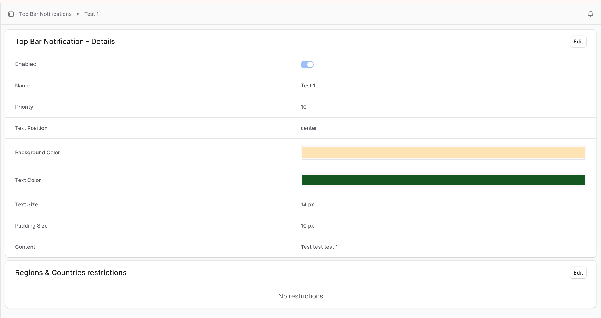
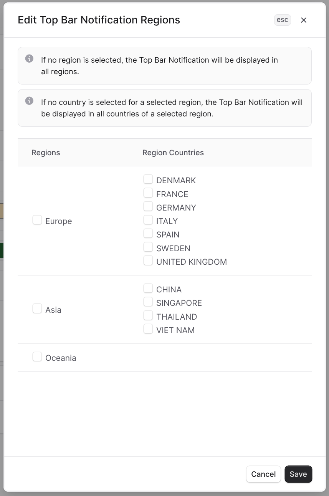

# Top Bar Notification

**Top Bar Notification** is a MedusaJS plugin that allows to display simple notices at the top of a storefront.

## Installation


1. Run the following command to install the plugin with **npm**:
```
npm install --save @magenable/medusa-plugin-top-bar-notification
```

or with yarn:
```
yarn add @magenable/medusa-plugin-top-bar-notification
```

2. In the medusa-config.js file of your MedusaJS store add the following plugin:
```
module.exports = defineConfig({
  // ...
  plugins: [
    {
      resolve: '@magenable/medusa-plugin-top-bar-notification',
      options: {},
    },
  ],
  // ...
})
```

3. Run migrations

```
npx medusa db:migrate
```

4. Install the following component for MedusaJS Starter Storefront (Next.js Starter Storefront) and then run the provided **npx** command:
```
npm install @magenable/medusa-plugin-top-bar-notification-storefront
```
```
npx @magenable/medusa-plugin-top-bar-notification-storefront
```

## Upgrade

```
npm update @magenable/medusa-plugin-top-bar-notification
```

or

```
yarn upgrade @magenable/medusa-plugin-top-bar-notification
```

## Admin UI






## Storefront view:


#### About developer
The component is developed by Magenable (https://magenable.com.au), eCommerce consultancy specializing in Magento/Adobe Commerce based in Melbourne, Australia
